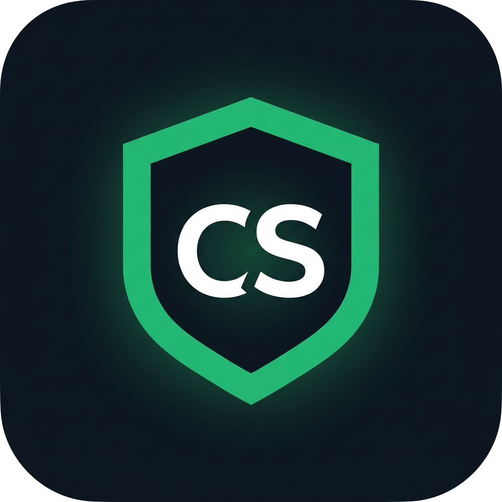
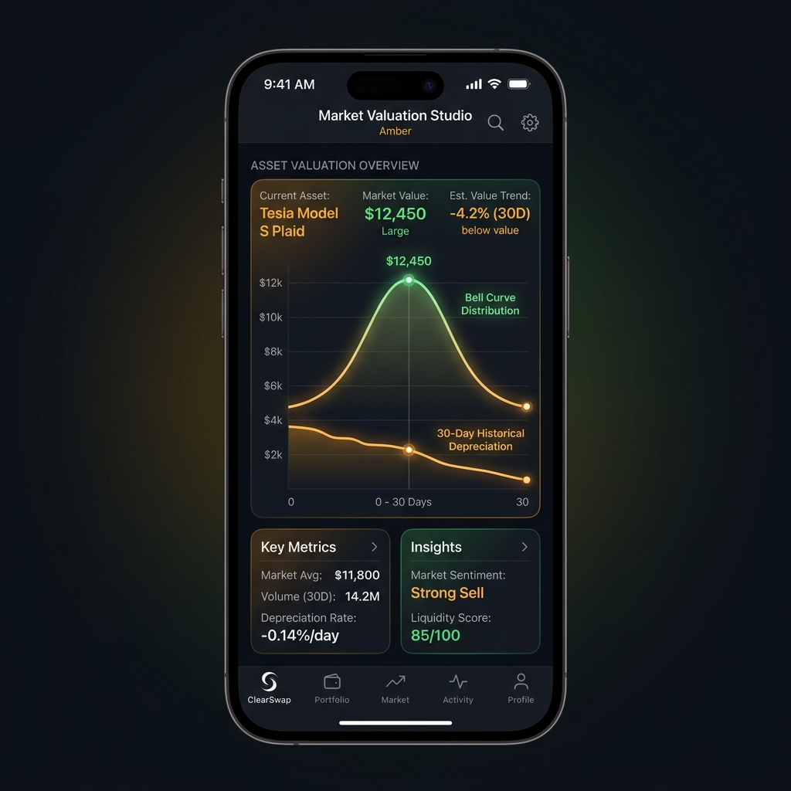
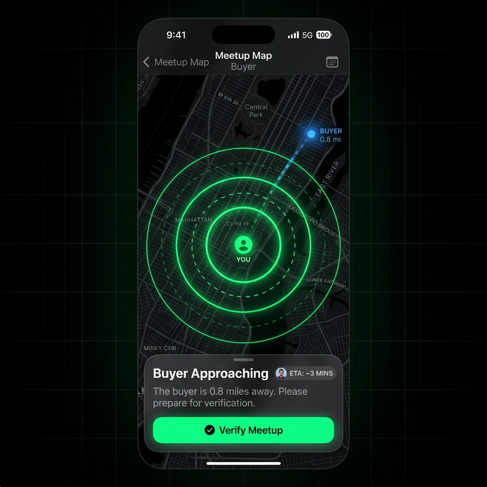
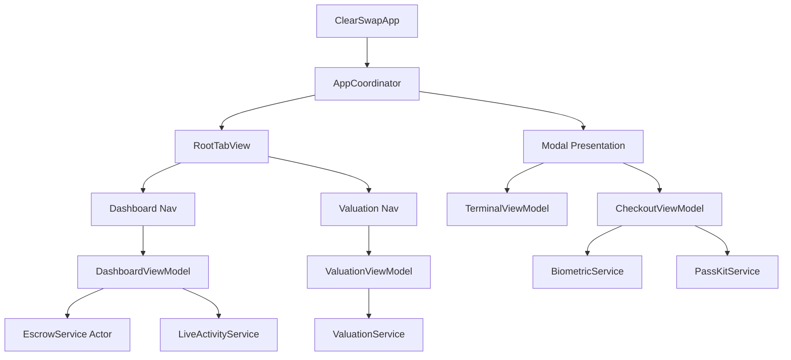
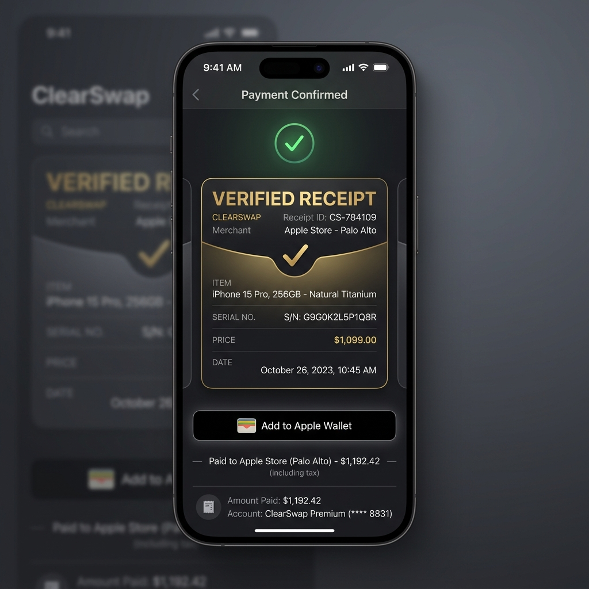

<div align="center">
  
  <h1>ClearSwap</h1>
  <h3>Native P2P Checkout & Apple Wallet Escrow Terminal</h3>
  
  <p>
    
    
    
    
  </p>
</div>

---

## ▎Overview

**ClearSwap** attacks the core of secondhand marketplace friction: peer-to-peer (P2P) payments, escrow trust, dynamic pricing, and post-transaction retention. It replaces complex custom UI models with Apple's most prestigious system-level frameworks—**Live Activities**, **Apple Wallet (PassKit)**, and **Swift Charts**—to build a native checkout terminal designed for production-grade fintech environments.

<div align="center">
  
  
  
</div>

---

## ▎Web Simulator (Next.js)

Don't have an iOS device handy? We've built a **pixel-perfect, interactive E2E simulator** on the web! Located in the `web/` directory, this Next.js web app provides a 7-step interactive story mimicking the native iOS flows (from Market Intelligence to Apple Wallet Receipts).

* **Tech Stack:** Next.js 15, TailwindCSS (Memphis Design System), Framer Motion, Playwright.
* **Try it out:** Navigate to the `web/` folder, run `npm install`, and `npm run dev`.

---

## ▎Core Features & Integrations

### Market Valuation Studio
Stop guessing. The pricing engine utilizes **Swift Charts** to draw a real-time bell curve of an item's market value across conditions (Fair, Good, Mint, New). A secondary time-series line chart tracks the 30-day historical depreciation.

### Proximity Radar & Live Activities
Zero trust required. Funds are locked in escrow before a meetup. The **Meetup Radar** uses `MapKit` to track the buyer's approach, while `ActivityKit` broadcasts ETA and proximity directly to the iOS Lock Screen and Dynamic Island.

### POS Terminal & Escrow Release
Transform the seller's iPhone into a Point-of-Sale terminal. The app generates a pulsing, high-contrast QR code payload. The buyer scans this, authenticates with **Face ID (LocalAuthentication)**, and releases the escrow cryptographic hash via the `EscrowActor`.

### Verified Receipts & Apple Wallet
The moment payment is confirmed, a signed "Verified Receipt" is generated via **PassKit**. This lands directly in the user's Apple Wallet, retaining serial numbers and warranty periods long after the app is closed.

<div align="center">
  
  
</div>

---

## ▎Architecture

ClearSwap enforces strict **Swift 6 Concurrency** and a robust **MVVM-C** (Model-View-ViewModel-Coordinator) pattern.



### Technical Stack
* **Language:** Swift 6 (Strict Concurrency Checked)
* **UI Framework:** SwiftUI (iOS 18 APIs)
* **Local Persistence:** SwiftData (`@Model`)
* **State Management:** `@Observable` macro + Environment Objects
* **Haptics:** `CoreHaptics` (Custom Apple Pay tap-tap-rumble pattern)

---

## ▎Quick Start

### Requirements
* Xcode 16.0+
* iOS 18.0+ Simulator or Physical Device (Physical device required for Face ID, Core Haptics, and Live Activities)
* XcodeGen

### Installation

1. Clone the repository:
```bash
git clone https://github.com/AyushCoder9/ClearSwap.git
cd ClearSwap
```

2. Generate the Xcode project:
```bash
xcodegen generate
```

3. Open the project:
```bash
open ClearSwap.xcodeproj
```

4. Build and Run:
* Select your Personal Development Team in the Signing & Capabilities tab.
* Select a physical iPhone 15 Pro or iPhone 16 Pro as the destination.
* Press `Cmd + R`.

---

## ▎UI / UX Design Language

The application employs a strict design system (`DesignTokens.swift`) inspired by modern fintech applications:

* **Backgrounds:** Deep slate (`#0F1720`) with mesh-gradient underlays.
* **Accents:** High-visibility Emerald Green (`#2EBF72`) and Warning Amber.
* **Materials:** Extensive use of `ultraThinMaterial` and custom glassmorphism borders.
* **Micro-interactions:** Custom shimmering masks on loading states, pulsing geometry on the radar screen, and dynamic scaling on the Swift Charts.

<div align="center">
  
</div>

---

<div align="center">
  <p>Designed and engineered for iOS 18.</p>
</div>
